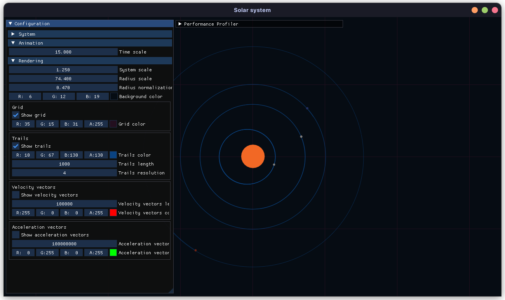
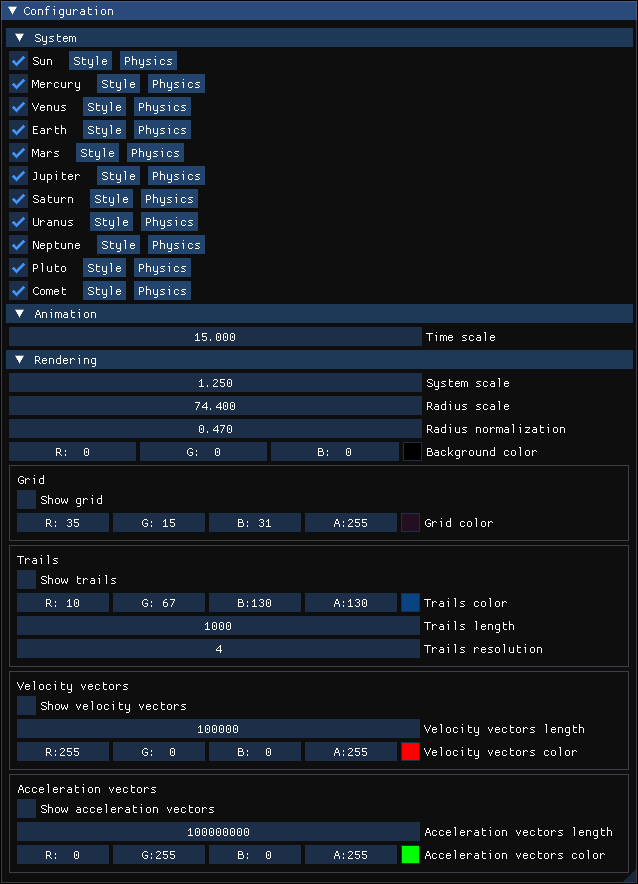
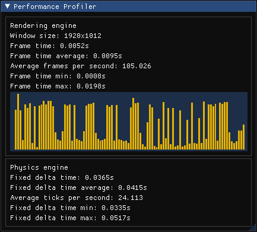

# Solar system simulation



## 👀 Overview

### 📓 Context

This is a homework assignment with the theme of "Solar system". The language have to be Python and the dataset is freely chosen.
I chose to make a physics simulation of the solar system with real data.

### 🧑‍💻 Tech stack

This is a solar system simulation written in Python and using the PyImGUI library for the GUI (Python bindings for the C++ library Dear ImGUI), the PyOpenGL library for the OpenGL bindings and the GLFW library for the window management.

## Usage

### 📥 Requirements

- Python 3

### 💾 Installation

- Clone the repository with the following command :

```bash
git clone https://github.com/Paracetamol56/Solar-system-python.git
cd Solar-system-python
```

- Install the dependencies with the following command :

```bash
pip install -r requirements.txt
```

### ▶ Run

- Run the simulation with the following command :

```bash
python src/main.py
```

### 🔧 Configuration

Once the application is running, you can configure the simulation with the following panel. It allows you to modify settings about the system itself, the animation and the rendering/appearance.



- **🪐 System**: Under this section, you can check/uncheck the bodies you want to render and access a few more settings about each one of them:
	- **Style**: You can customize the color of each body and change their radius individually. This as no effect on the physics simulation, it's only for the appearance.
	- **Physics**: You also have access physical informations about each body (mass, position, velocity and acceleration). As always in this program, units are following the international system of units (SI). The coordinates origin is the center the screen. You ca actualy modify the values but since velocity, acceleration and position are computed every tick by the physics engine, they will be overwritten. Hovever, you can for example change the mass of a body on the fly and see the effect on the simulation (and this is fun).

- **💫 Animation**: Here, you can change the `Time scale` paramter which is used to speed up or slow down the simulation.<br>
	>NB: It doesn't make more physics update, it's just a factor applied to the time delta between each physics update.
- **📺 Rendering**:
	- **System scale**: You can change the `System scale` parameter which is used to zoom in or out the system.
	- **Radius scale**: You can change the `Radius scale` parameter which is used to scale the radius of each body.
	>Note that this parameter is independent from the `System scale` parameter.<br>If you want to achieve the most realistic rendering (with radius and distances that match the real ones), you should keep these two parameters at 1.0. However, they are useful to see the system in a more "macroscopic" way.
	- **Radius normalization**: The `Radius normalization` is a convienient parameter added to be able to see very small bodies along with very big ones. At 0.0, the radius scale is perfectly respected. At 1.0, the radius scale is ignored and all bodies are rendered with the same radius.
	- **Background color**: You can change the `Background color` to your liking.
	- Finaly, you can enable or disable the grid and change its color. The grid size is fixed to 1 astronomical unit (AU), which is the average distance between the Earth and the Sun.

### 📈 Performance profiler

You also can have an idea of the performance of the program by opening the performance profiler.



The profiler pannel is separated in two parts:
- **🎥 Rendering engine**: This is only about how fast the rendering engine is able to render the scene. It's not related to the physics engine.<br>In this section, you can see :
	- The window size
	- The time it took to render the last frame
	- The average time it took to render the last 100 frames
	- the average frame rate (FPS) over the last 100 frames
	- The minimum and maximum time it took to render a frame over the last 100 frames
	- A plot of the last 100 frames rendering time
- **⚙ Physics engine**: This covers the physics engine, which is more or less indenpendant from the rendering engine. Physics updates (also called ticks) happen at a fixed rate and not as often as the rendering updates.<br>In this section, you can see :
	- The time between the last two physics updates
	- The average time between the last 100 physics updates
	- The average physics update rate (TPS) over the last 100 physics updates
	- The minimum and maximum time between two physics updates over the last 100 physics updates.

## 📊 Data

**📏 IMPORTANT :** Every number used in the simulation is in the metric system (meters, kilograms, seconds, etc.).

For the solar system reproduction, I gathered data from the [NASA website](https://nssdc.gsfc.nasa.gov/planetary/factsheet/) for each planet and the sun.
Data concerning celestial bodies are stored in the `data/` folder as JSON files (on file per system).

You are free create a brand new stellar system with hipotetical data, but you have to respect the JSON format.

I created additional systems :
- `data/binaryStars.json`: A system with two stars orbiting each other.
- `data/tatooSystem.json`: The famous Tatooine system from Star Wars. It's a binary system (two stars) with 3 planets. The aproximate distances and sizes are taken from this [Wikipedia ressource](https://commons.wikimedia.org/wiki/File:Diagram_of_the_fictional_Tatooine_Star_System_(Star_Wars).png?uselang=fr).